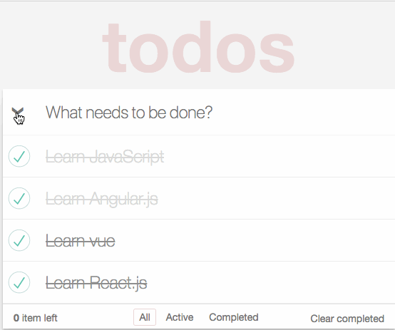

express-with-vue
==================
![][david-url]
![][license-url]

A damn easy customizable web application skeleton based [express.js](http://expressjs.com/) + [vue](https://vuejs.org/)

**Demonstration**



## Get Started ##

```bash
#clone this repo
git clone https://github.com/leftstick/express-with-vue.git
cd express-with-vue

#install dependencies
npm install

#start portal at 3000 port in debug mode
npm start
```

>Now you can visit portal through: [http://localhost:3000](http://localhost:3000)


For more information, see [Development Guide](./docs/document.md)


## LICENSE ##

[MIT License](https://raw.githubusercontent.com/leftstick/express-with-vue/master/LICENSE)


[david-url]: https://david-dm.org/leftstick/express-with-vue.png
[license-url]: https://img.shields.io/github/license/leftstick/express-with-vue.svg